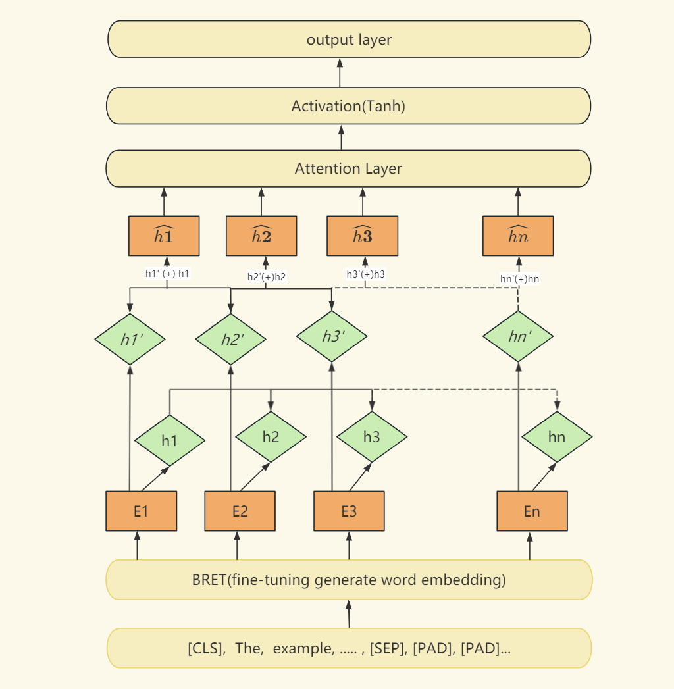

# Background

Comparing the performance of the BERT Attention Bi-LSTM and the R-BERT model.

## Library

- torch
- torch-summary
- datasets
- nltk
- numpy
- transformers

## Model Diagram

The diagram for the BERT Attention Bi-LSTM and the R-BERT model.  

BLSTM Model  

